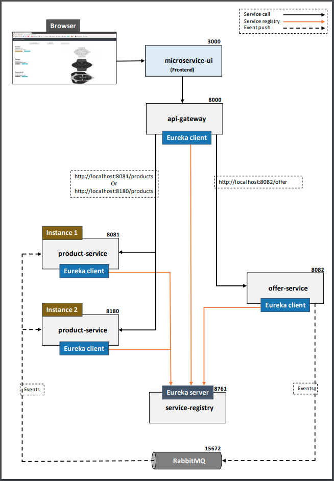
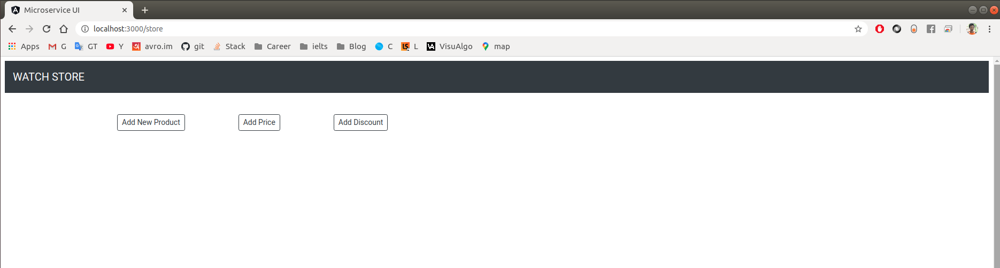
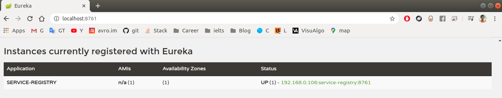
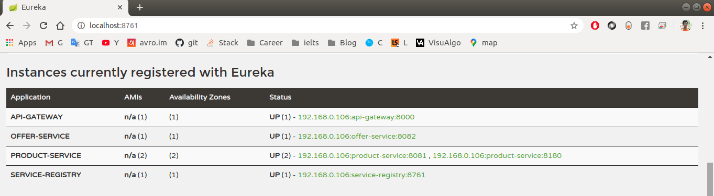
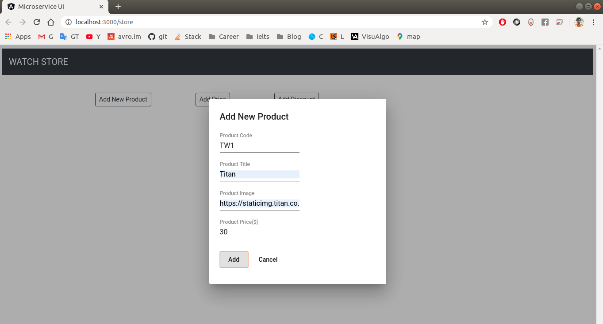
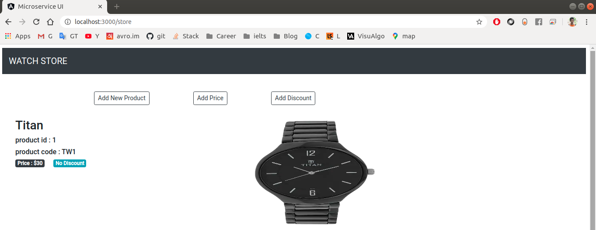
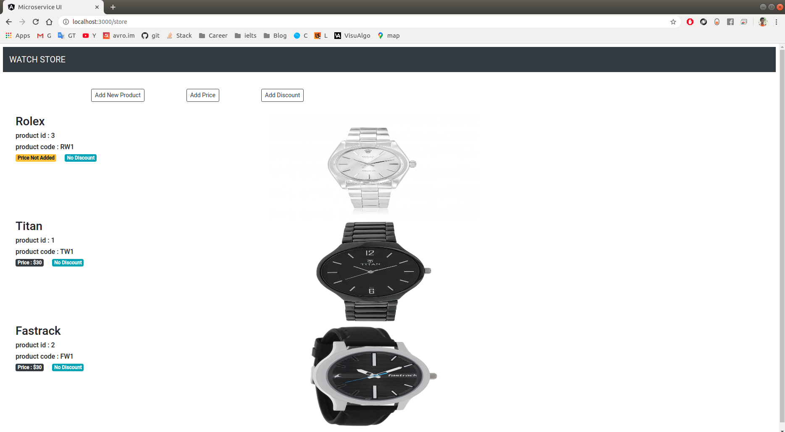
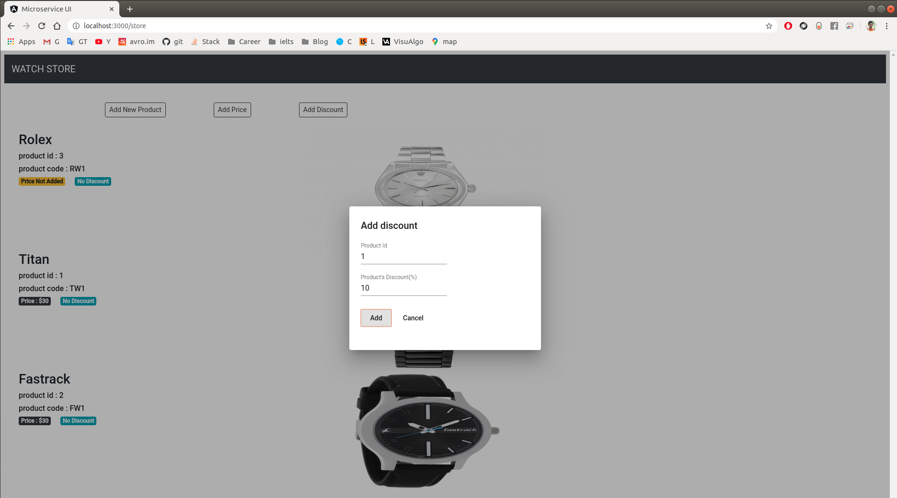
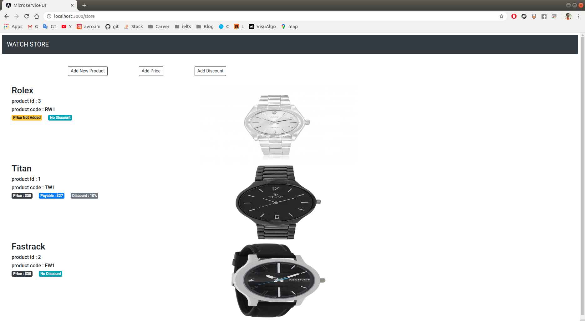

# Guideline how to read this document
Read this documentation with full concentration and understand clearly how the application working. I tried to describe 
as simple as possible. No need to run the application or understand the code initially. **Read the documentation and understand 
the workflow diagram first**. I have used Java, Spring Boot and Angular but you no need to know any specific language or technology to understand microservice 
concept. Just read the documentation first.   

Once you have completed the documentation then you can run every application in your local system by configuring system 
prerequisites and don't forget to notice terminal log when you run all application, it helps for better understanding. 
Here is total 5 separate application (1 frontend + 4 backend).
- microservice-ui (frontend)
- service-registry
- api-gateway
- product-service
- offer-service

# What is microservice?
Microservice is a modern as well as a popular architecture of designing software application over the last few years. 
There are lots of content on the internet to describe what microservice really is and those are very informative. 
But here I wanna describe it simply, concisely in production style.  

A microservice application is consist of different services where every service is an application which is
  1. **Independently deployable**   
  2. **Independently scalable**  

above two are the key requirements of a microservice application.

In this microservice application here are two service **product-service** and **offer-service** both independently 
deployable and scalable. **They are using two different database but this is not an issue about microservice architecture. 
They can use the same database.**

To expose these two service as microservice architecture I used two other service those are **service-registry** for 
service discovery and **api-gateway** for dynamic service routing as well as load balancing.

# Have a look the workflow


# Run the services

## System configuration prerequisites
### 1. Clone this project
Open terminal and run
````
git clone https://github.com/hnjaman/complete-microservice-application.git
````
In your current directory ``complete-microservice-application`` directory will be created with five different project inside.

### 2. Install Java and Maven
Install java 8 or higher version and Apache Maven 3.6.0 on your system.
Java 11 is installed in my system. This is not an issue. It will work fine in java 8 to java 11.

### 3. Install RabbitMQ
RabbitMQ is Advanced Message Queuing Protocol (AMQP), It should be installed and running in your system where product 
service will be deployed. Though this example is for localhost you need to install in your local computer and by default 
run in ``http://localhost:15672/``  
Username: guest  
Password: guest
  
##### [Mac OS]  
I have prepared a bash file **install-rabbitmq-macOS.sh** to install RabbitMQ in MacOS. Type `bash install-rabbitmq-macOS.sh` in 
your system terminal and after installation completed run `rabbitmq-server` command to start RabbitMQ.

##### [Ubuntu OS]
Check this for [Installing on Debian and Ubuntu](https://www.rabbitmq.com/install-debian.html)  

RabbitMQ commands for ubuntu  
--to start `sudo service rabbitmq-server start`  
--to restart `sudo service rabbitmq-server restart`  
--to stop `sudo service rabbitmq-server stop`  
--to check status `sudo service rabbitmq-server status`


##### [Windows]  
Check this for [Installing on Windows](https://www.rabbitmq.com/install-windows.html#installer)

### 4. Lombok
Lombok plugin should be installed in you IDE otherwise IDE will catch code error. I used Intellij Idea and I had to install 
lombok plugin.

### 5. Install Node, Angular and Angular CLI
In my system I used
````   
Angular CLI: 8.3.25
Node: 12.13.1
Angular: 8.2.14 
````
You need to install Node 12 or higher version and Angular 8 or higher version to run microservice-ui application.

## Run microservice-ui application
It's an angular based user interface application for these microservice frontend. It's not any high functional user interface 
I just tried to consume the backend services from here. You can check all the api just from **Postman**.  

Open terminal run below command to launch microservice-ui application
````
cd microservice-ui/
npm install
ng s --port 3000 --open
````
It will open a new tab in your browser with **http://localhost:3000/store** url as frontend application.
When it opens it calls ``http://localhost:8000/product-service/products`` by default to fetch all product list. 
It will not respond any products because backend services are not started yet.   



UI application is ready, Now we need to run it's backend applications. 
All the backend applications are developed by spring-boot.

## Run service-registry application
service-registry is the application where all microservice instances will register with a service id. When a service wants 
to call another service, it will ask service-registry by service id to what instances are currently running for that service id. 
service-registry check the instances and pass the request to any active the instance dynamically. This is called service 
discovery. The advantage is no need to hard coded instance ip address, service registry always updates itself, if one instance 
goes down, It removes that instance from the registry. 
- **Eureka** is used to achieve this functionality

Open a new terminal and run below command to launch service-registry
````
cd service-registry/
mvn clean install
mvn spring-boot:run
````
service-registry will launch in http://localhost:8761/  



Right now only service-registry is registered with Eureka. In your system it will show your ip address.  
All the backend application will register here one by one after launching and service-registry will show like this. 



## Run api-gateway application
api-gateway application is the service for facing other services. Just like the entry point to get any service. Receive 
all the request from user and delegates the request to the appropriate service. 
- **Zuul** is used to achieve this functionality

Open a new terminal and run below command to run api gateway
````
cd api-gateway/
mvn clean install
mvn spring-boot:run
````
The application will run in ``http://localhost:8000/``.

api-gateway is configured such a way that we can call product-service and offer-service api through api-gateway.   
Like - when we call with a specific url pattern api-gateway will forward the request to the corresponding service based 
on that url pattern.  

| API             | REST Method   | Api-gateway request                                       | Forwarded service   | Forwarded URL                      |
|-----------------|:--------------|:----------------------------------------------------------|:--------------------|:-----------------------------------|
|Get all products |GET            |``http://localhost:8000/product-service/products``         | product-service     | ``http://localhost:8081/products`` |    
|Add new product  |POST           |``http://localhost:8000/product-service/products``         | product-service     | ``http://localhost:8081/products`` |    
|Update price     |PUT            |``http://localhost:8000/product-service/products/addPrice``| product-service     | ``http://localhost:8081/products`` |    
|Add offer        |POST           |``http://localhost:8000/offer-service/offer``              | offer-service       | ``http://localhost:8082/offer``    |

Above table contains all the used api in this entire application.

If we have multiple instance for product-service like ``http://localhost:8081`` and ``http://localhost:8180``.
So when we call ``http://localhost:8000/product-service/products`` api gateway will forward it to one of the two instance 
of product-service as load balancing in Round-robin order since Zuul api-gateway use Ribbon load balancer.
Api gateway frequently keep updated all available instance list of a service from eureka server.  
  
**you can create as many as instance you need for product-service as well as offer-service api-gateway will handle it smartly.**

So we can say that api-gateway is the front door of our backend application by passing this we need to enter kitchen or 
washroom whatever. [Bad joke LOL]

## Run Product service
Open a new terminal and run below command
````
cd product-service/
mvn clean install
````
The ``mvn clean install`` command will create a ``product-service-0.0.1-SNAPSHOT.jar`` inside ``target`` directory. 
We will run two product service instance by two different port. Run below command in a separate terminal
````
cd target/
java -jar product-service-0.0.1-SNAPSHOT.jar --server.port=8081
````
Above command will run product-service in 8081 port.

Run another instance of product-service in 8180 port by running below command in another terminal
````
java -jar product-service-0.0.1-SNAPSHOT.jar --server.port=8180
````
After few seconds you can see there are 2 instance running for product-service which is registered with Eureka server in http://localhost:8761/

***Note:** Both instance are running as separate application but they are using same database.*

Access product-service data source console in browser by
`localhost:8081/h2`  
To connect product data source h2 console use below credentials   
JDBC URL  : `jdbc:h2:~/product`  
User Name : `root`  
Password  : `root`  

Check product table. Right now there is no products.  
Let's add a new product by calling `localhost:8000/product-service/products` **POST** endpoint with below body in postman.
````
{
	"productCode": "TW1",
	"productTitle": "Titan",
	"imageUrl": "https://staticimg.titan.co.in/Titan/Catalog/90014KC01J_1.jpg?pView=pdp",
	"price": 30
}
````
Or in microservice-ui press ``Add New Product`` button and fill the pop-up window with above value then press ``Add`` to 
add new product.   



After adding new product the window will be refreshed and you will see like this   


maf 
Let's add two more new products

````
{
	"productCode": "FW1",
	"productTitle": "Fastrack",
	"imageUrl": "https://staticimg.titan.co.in/Fastrack/Catalog/38051SP01_2.jpg",
	"price": 30
}
````

````
{
	"productCode": "RW1",
	"productTitle": "Rolex",
	"imageUrl": "https://www.avantijewellers.co.uk/images/rolex-watches-pre-owned-mens-rolex-oyster-precision-vintage-watch-p3003-7660_medium.jpg",
	"price": null
}
````
So far our browser window like this  



If you check product table there is three product added with no **discount_offer**. We will add **discount_offer** by 
sending an event notification from other offer-service application.

One additional information, I have not added any price when adding *Rolex*. Price can be added or updated later after 
adding any product by ``Add Price`` button.

## Run Offer service
Open separate terminal and run
 ````
 cd offer-service/
 mvn clean install
 mvn spring-boot:run
 ````
Application will run on ``http://localhost:8082/``

Access it's data source console in browser by
`localhost:8082/h2`  
To connect offer data source h2 console use below credentials  
JDBC URL  : `jdbc:h2:~/offer`  
User Name : `root`  
Password  : `root`

Check offer table and there is no offer right now.  
Let's add a offer for *product_id = 1* by calling `http://localhost:8000/offer-service/offer` POST endpoint with below body in postman
````
{
	"productId": 1,
	"discountOffer": 10
}
````
Or in microservice-ui press ``Add Discount`` button and fill the pop-up window with above value then press ``Add`` to 
add discount for *product_id = 1*  



If you check offer table there is an offer recorded for *product_id = 1*  and browser will show  



Now you are seeing *Payable: $27* for *product_id = 1* after calculating discount.

**Alert! I am going to show you an interesting thing**, if you check product table from product-service data source 
where *product_id = 1* is updated by discount_offer = 10 and current_price = 27.

**Note:** Here Offer and Product table are from two different database and running on different port.
Because both service are using different database. 

Here you called offer-service api and it's added a new offer record in it's own data source as well as updated product 
record where *product_id = 1*. 

### So how is this happened?
From **offer-service** when we add an offer for a specific product, it pushes an event notification to **product-service** 
with discount_offer and **product-service** received the event then update it's own database according to it's own business
logic of the event.

### How service to service event working?
Here RabbitMQ is configured with both offer-service and product-service. In offer-service when a offer added it will push 
an event to product-service. RabbitMQ push the events as a queue[one by one serially] order from event producer to event
consumer. For these event offer-service is producer, product-service is consumer. RabbitMQ ensure all event must be pushed 
to consumer if RabbitMQ server is running.

### What will happen if the RabbitMQ server is shutdown?  
No events will be pushed to the consumer. If there is any stored events in RabbitMQ server memory before shutdown those 
will be lost too.  
**Note:** It is possible to overcome this limitation by using persistence mechanism which will keep safe from losing stored events.
This mechanism is not implemented here that's why am skipping the issue.    

### What will happen with the events when all product-service instance are shutdown?
RabbitMQ keeping all the events in itself will wait for any product-service instance when a product-service instance 
relaunched then RabbitMQ will start to push it's events immediately to running product-service instance. You can test it 
by shutting down all product-service by typing ``ctrl + c`` in all product-service launching terminal.  
This functionality is called **Event Driven Development(EDD).** EDD is not a mandatory part of microservice application, 
It's a smart way to do service to service communication. 

Congratulations you have completed the documentation still recheck the workflow diagram that will make you 100% clear now.

# Conclusion
So far this is a complete microservice application. You can enhance the application by adding other service like 
product-service or offer-service(what your requirements demands) by configuring with service-registry and api-gateway.
You also can furnish the application with other handy application like Hystrix, Zipkin, Feign, Sidecar. There are lots 
of handy tools to make the application interactive.  

Hystrix is used here as circuit breaker in api-gateway but microservice-ui still not configured with Hystrix functionality 
yet you can check it in postman by requesting any product-service api by keeping all product-service instance shutdown. 
In this case Hystrix will respond with a default message instead of responding Internal Server Error(500) HTTP status.

# Copyright & License

MIT License, see the link: [LICENSE](https://github.com/hnjaman/complete-microservice-application/blob/master/LICENSE) file for details.
